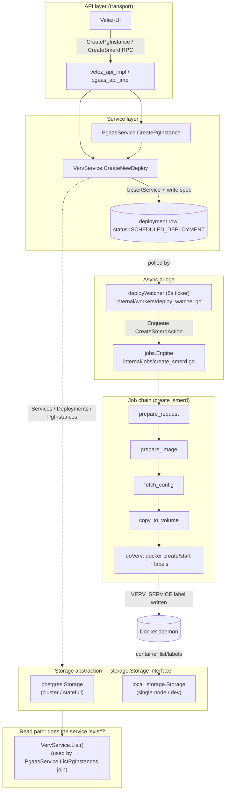

```mermaid
flowchart TB
    subgraph API["API layer (transport)"]
        UI[Velez-UI] -->|CreatePgInstance / CreateSmerd RPC| Impl[velez_api_impl / pgaas_api_impl]
    end

    subgraph SVC["Service layer"]
        Impl --> Verv[VervService.CreateNewDeploy]
        Impl --> Pgaas[PgaasService.CreatePgInstance]
        Pgaas --> Verv
        Verv -->|UpsertService + write spec| DeployRow[(deployment row:\nstatus=SCHEDULED_DEPLOYMENT)]
    end

    subgraph WATCH["Async bridge"]
        Ticker["deployWatcher (5s ticker)\ninternal/workers/deploy_watcher.go"]
        DeployRow -.polled by.-> Ticker
        Ticker -->|Enqueue CreateSmerdAction| Jobs["jobs.Engine\ninternal/jobs/create_smerd.go"]
    end

    subgraph JOBS["Job chain (create_smerd)"]
        Jobs --> J1[prepare_request] --> J2[prepare_image] --> J3[fetch_config] --> J4[copy_to_volume] --> J5[doVerv: docker create/start + labels]
    end

    J5 -->|VERV_SERVICE label written| Docker[(Docker daemon)]

    subgraph STORE["Storage abstraction — storage.Storage interface"]
        direction LR
        PG["postgres.Storage\n(cluster / statefull)"]
        LS["local_storage.Storage\n(single-node / dev)"]
    end

    Verv -.Services / Deployments / PgInstances .-> STORE
    Docker -.container list/labels.-> LS

    subgraph READ["Read path: does the service 'exist'?"]
        List["VervService.List()\n(used by PgaasService.ListPgInstances join)"]
    end
    STORE --> List
```