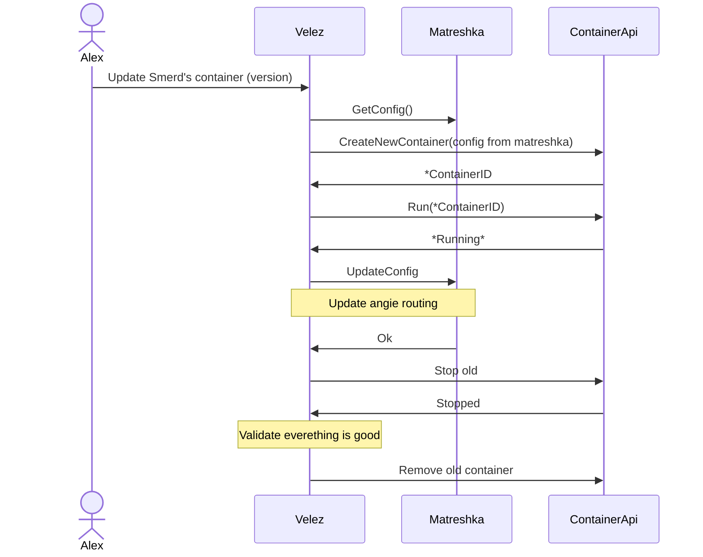

# Smerds management logic

## Updating / Restarting

```mermaid
sequenceDiagram
%% Update/Restart Smerd
    actor Alex
    Alex->>Velez: Update Smerd's container (version)
    Velez->>Matreshka: GetConfig()
    Velez->>ContainerApi: CreateNewContainer(config from matreshka)
    ContainerApi->>Velez: *ContainerID
    Velez->>ContainerApi: Run(*ContainerID)
    ContainerApi->>Velez: *Running*
    Velez->>Matreshka: UpdateConfig
    note over Velez, Matreshka: Update angie routing
    Matreshka->>Velez: Ok
    Velez->>ContainerApi: Stop old
    ContainerApi->>Velez: Stopped
    note over Velez: Validate everething is good
    Velez->>ContainerApi: Remove old container
    
```